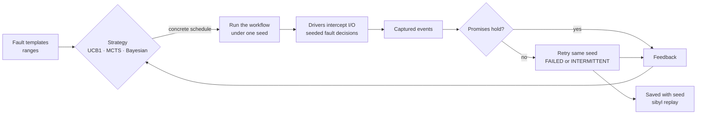
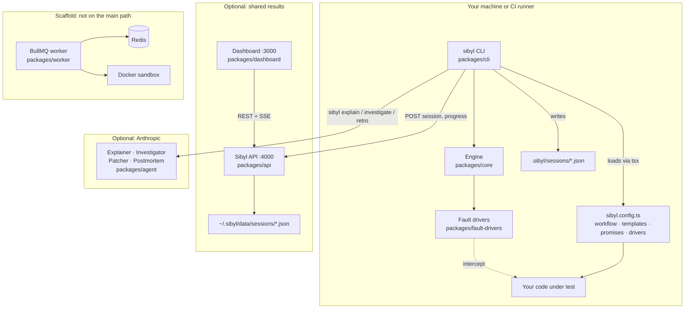
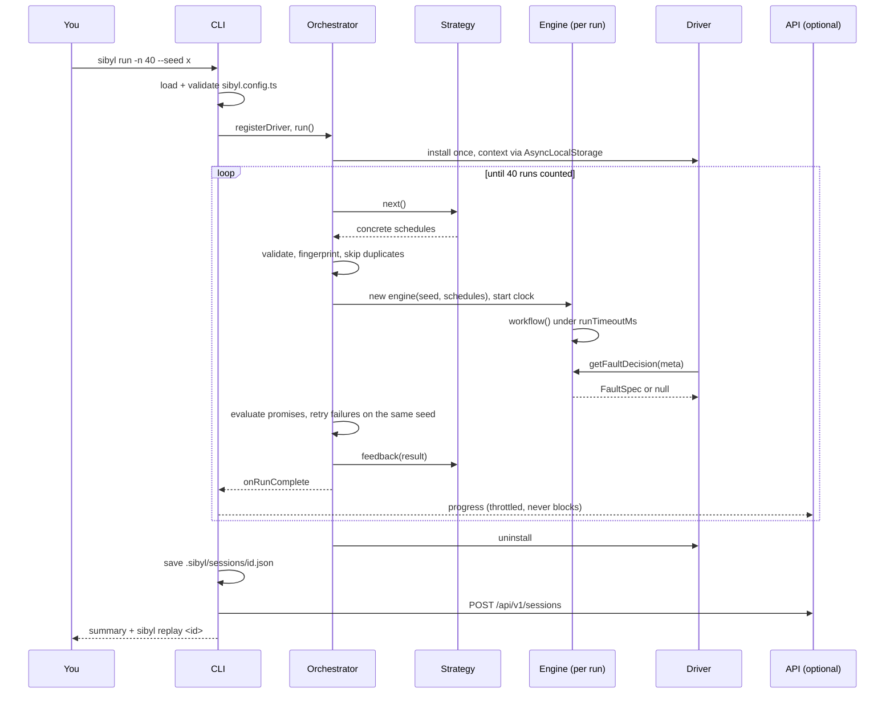
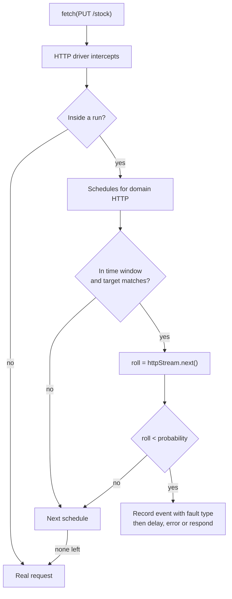
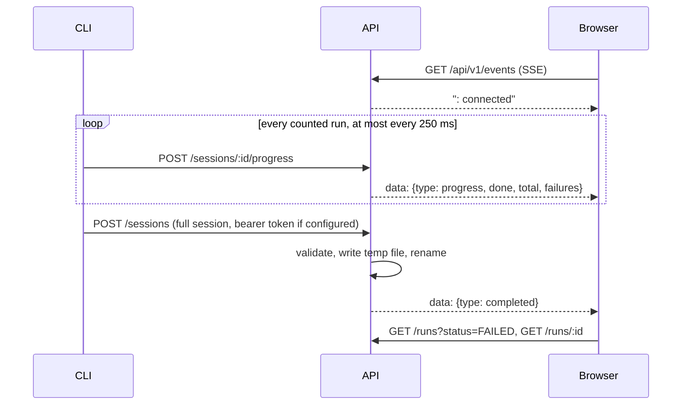
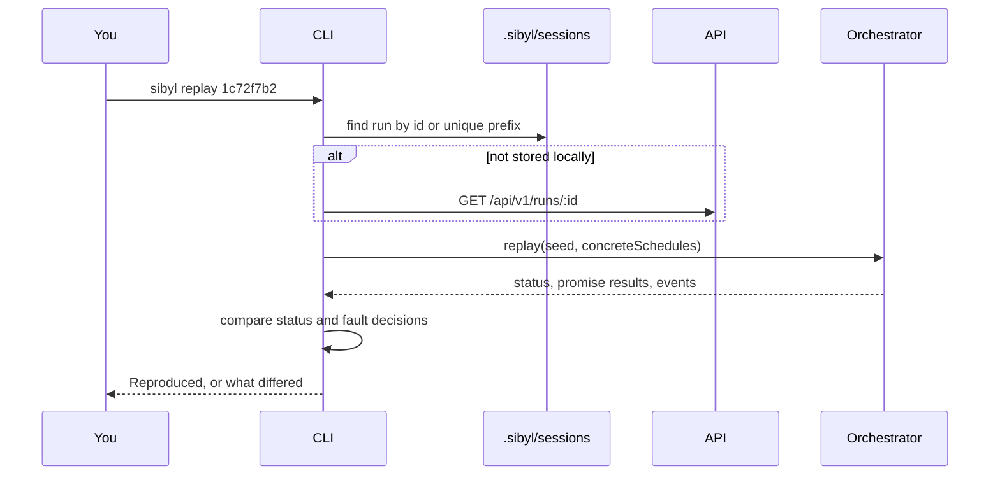
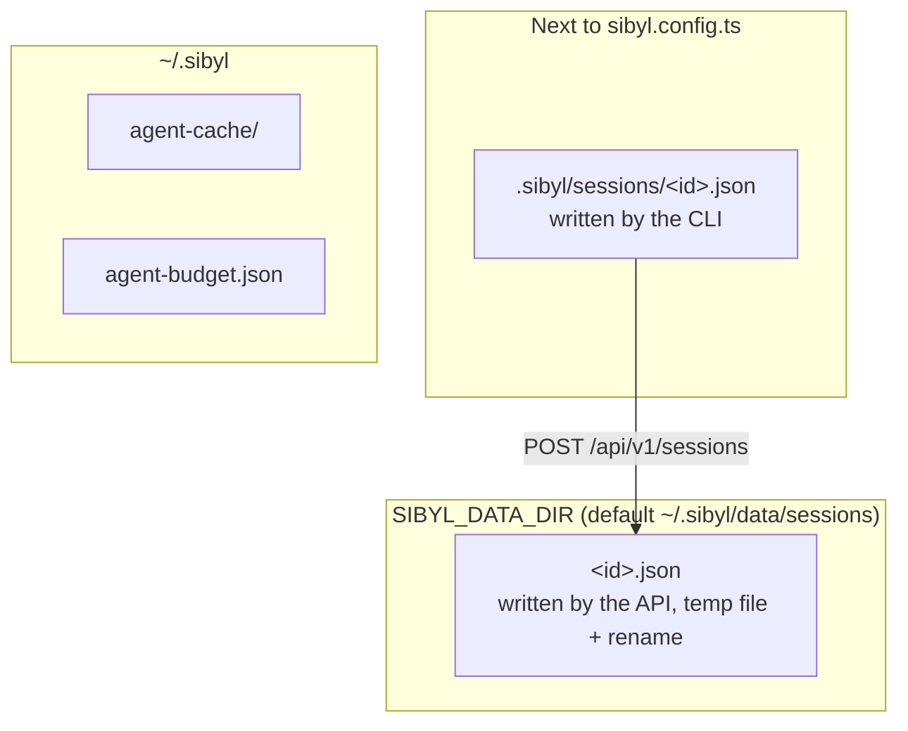
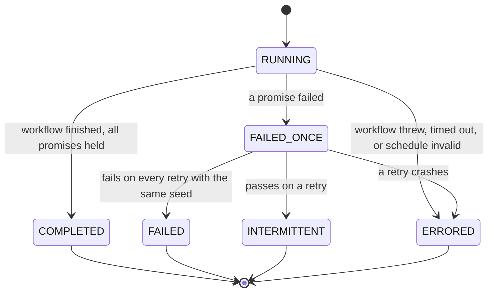

# Sibyl — Architecture

> The short version is in the [README](README.md). This is the long form: what runs where, how a
> fault decision is made, why a failure replays, and which claims are backed by which test.
>
> Reference material lives in [`docs/`](docs/README.md): the [REST API](docs/api.md), the
> [CLI](docs/cli.md), [configuration](docs/configuration.md), and
> [development](docs/development.md).

Sibyl runs your code many times, lets a search algorithm decide which I/O calls fail and how, and
checks after every run whether the invariants you wrote still hold. A run that breaks one is saved
with the seed that produced it, so the failure can be replayed on demand rather than hoped for again.

---

## 1. Core Paradigm

Three ideas hold the design together.

**Every fault decision comes from a seed.** No `Math.random()` anywhere between "should this call
fail?" and the answer. A run's seed and its concrete schedule determine every decision, so a failure
found once is a failure you can have again. Wall-clock timing is the one thing a seed cannot control,
and Sibyl says so when it matters (§4.4).

**Faults live at your application's boundaries, not the infrastructure's.** The HTTP driver
intercepts `fetch` and `http.request` inside your process; the database driver wraps your `pg` pool.
The bugs worth finding are in how *your* code handles a timeout, a 503, a slow write — not in whether
Kubernetes restarts a pod.

**Search, don't sample.** Faults are described as templates with ranges ("a SLOW_RESPONSE of 1–120 ms
on PUT"). A strategy picks concrete values, learns from which runs failed, and concentrates on the
region that breaks things. The strategy is pluggable and knows nothing about execution.



---

## 2. Architecture Topology

The engine is a library. Everything else is a way to drive it or look at what it found.



Solid arrows are calls Sibyl makes. The dotted arrow is interception: your code calls `fetch`, and
the driver decides what `fetch` returns.

**What the API is not.** It runs nothing. It stores sessions the CLI uploads and serves them. A
search always runs where the CLI runs, next to the code under test, which is what lets the drivers
intercept that code's I/O. The local session file is the record; the upload is a copy.

**What the worker is not, yet.** `packages/worker` is a BullMQ consumer with a correct idempotency
lock and dead-letter handling, but the sandbox command it starts (`dist/sandbox-worker.js`) does not
exist, and nothing enqueues jobs. It is scaffolding for distributed execution, tested as a unit, not
part of any working flow. See §6.3.

---

## 3. Components Deep Dive

### 3.1 PRNG — `packages/core/src/prng.ts`

Mulberry32, seeded through FNV-1a so string seeds work. Two properties matter:

- **`fork(namespace)` is order-independent.** A child stream depends only on the parent's *initial*
  seed and the namespace, never on how many numbers the parent has drawn. Each fault domain gets its
  own fork, so adding an HTTP call cannot shift the decisions of the database driver.
- **State wraps at 32 bits.** It used to grow as a double; outputs were identical for ~4.9M draws and
  then silently diverged. `test/regressions.test.ts` pins this.

`uuid()` draws ids from the stream, so run ids are reproducible from the session seed.

### 3.2 VirtualClock — `packages/core/src/clock.ts`

Patches `Date`, `setTimeout`, `setInterval` and their `clear*` functions.

| Mode | `Date.now()` | Timers |
|---|---|---|
| `realtime` (default) | Wall clock + skew + jumps | Native timers, tracked so they are cleared when the run ends |
| `accelerated` | Virtual; moves only when a timer fires | Queued; with `autoAdvance` (the engine turns it on) time jumps to the next timer whenever the event loop is idle, so a 60 s `setTimeout` completes instantly |

The design constraints, each of which was once a bug:

- **Natives are captured once, at module load.** Capturing them per instance meant a clock built while
  another was installed saved the *fake* as native and restored it on uninstall, hijacking the
  process's timers for good.
- **Global patching is reference-counted, and calls are routed per run.** The orchestrator sets a
  context resolver, so `Date.now()` inside run A reads run A's clock while run B, concurrent in the
  same process, reads its own. Outside any run it reads real time.
- **Timer handles implement `refresh()`, `hasRef()`, `ref()`, `unref()`.** Node's `fetch` (undici)
  calls `refresh()`; without it, installing the clock broke `fetch`.
- **`Date()` without `new` returns a string**, and `instanceof Date` holds both ways.

Accelerated mode is for code that *waits*; it is the wrong mode for code that races real network I/O,
because virtual time will outrun the socket.

### 3.3 Engine — `packages/core/src/engine.ts`

One `SimulationEngine` per run. It owns the run's seed, clock, per-domain PRNG forks and captured
events, and answers one question for drivers:

```ts
evaluateFaultDecision(domain, targetMetadata): FaultSpec | null
```

For each schedule in the domain whose time window and `target` match the call's metadata, it draws
from the domain's stream and fires if `roll < probability` — strictly less, so probability 0 never
fires. CLOCK faults have no call to intercept, so they are decided once when the run starts.

### 3.4 Orchestrator — `packages/core/src/orchestrator.ts`

`SearchOrchestrator.run()` executes `iterations` runs across `concurrency` async workers:

1. **Claim** an iteration slot. (Checking the finished count instead let concurrent workers overshoot
   the budget.)
2. Ask the strategy for schedules; **validate** them with zod. A malformed schedule is an ERRORED run,
   not a crash.
3. Derive the run seed and run id from the master seed and attempt number.
4. **Deduplicate.** A fingerprint of the schedule plus the first 50 decisions per domain; a schedule
   already tried does not consume budget. Fifty duplicates in a row end the session early.
5. **Execute** inside `AsyncLocalStorage` with the run's engine, under a native-timer `runTimeoutMs`
   (default 30 s), cleaning up the sandbox and clock on every path.
6. Evaluate run-scoped promises against the captured events.
7. **Flake confirmation.** A failing run is re-executed with the same seed and schedule up to
   `flakeRetries` times (default 2). Fails every time → FAILED. Passes once → INTERMITTENT, which is
   reported as not passing.
8. Feed the result back to the strategy; call `onRunComplete`.

Drivers are installed once for the session and resolve the active engine through `AsyncLocalStorage`.
`replay(run)` executes one stored run with its seed and schedules and no strategy, deduplication or
retries.

### 3.5 Strategies — `packages/core/src/search/`

All three discretise each template's ranges into 4 buckets per dimension.

| Strategy | Learns | Notes |
|---|---|---|
| **UCB1** (default) | Failure rate per bucket, UCB1 exploration bonus | Unvisited buckets first; pending picks count as visits so concurrent workers spread out. On a failure it **shrinks**: tries the schedule with one fault removed at a time, and keeps shrinking from any smaller schedule that still fails. `getMinimalFailingSchedule()` returns the smallest. |
| **MCTS** | UCT over a tree with one level per template | A path fixes buckets for the first *k* templates; the rest are sampled. Feedback is credited to the leaf that produced the schedule, matched by schedule id. |
| **Bayesian** | TPE over `delayMs` | Once it has two passing and two failing samples, draws 25 candidates and picks the one maximising failure density over pass density. |

Strategies key their bookkeeping by **schedule id**. They used to attach hidden fields to the schedule;
the orchestrator's zod validation strips unknown keys, so no strategy ever received its own feedback.
UCB1 picked bucket 0 forever and Bayesian never left uniform sampling. Both are pinned by tests that go
*through the orchestrator*.

### 3.6 Promises — `packages/core/src/promise.ts`

A promise is `{ id, description, severity, evaluate(ctx) }`, returning a boolean or
`{ passed, message?, actualValue? }`. `ctx` holds the run id, the captured events and `timeline()`.
A promise that throws or returns something else fails with the reason as its message.
`scope: 'session'` promises run once at the end over all runs. `allOf`, `anyOf` and `snapshotPromise`
are combinators.

Promises can also close over application state, as both examples do; key that state by
`AsyncContext.getRunId()` if runs are concurrent.

### 3.7 Fault drivers — `packages/fault-drivers/`

Every driver implements `install(ctx)` / `uninstall()` and calls `ctx.getFaultDecision` on each
operation and `ctx.recordEvent` when it injects something.

| Package | How it hooks in | Faults |
|---|---|---|
| `http` | Patches global `fetch` and `http.request` (via `@mswjs/interceptors`); target `url`, `method` | `TIMEOUT`, `SLOW_RESPONSE`, `CONNECTION_REFUSED`, `HTTP_5XX`, `HTTP_4XX`, `PARTIAL_RESPONSE` |
| `db` | `wrapPgPool(pool)`, `wrapMysql2Pool(pool)` | `QUERY_TIMEOUT`, `CONNECTION_DROP`, `DEADLOCK`, `SLOW_QUERY`, `PARTIAL_COMMIT` |
| `mq` | `wrapKafka(kafka)`, `wrapSqsClient(client)`; target `topic`, `operation` | `MESSAGE_DELAY`, `MESSAGE_DUPLICATE`, `MESSAGE_LOSS`, `OUT_OF_ORDER_DELIVERY`, … |
| `grpc` | `createInterceptor()` for a grpc-js client; target `method` | `DEADLINE_EXCEEDED`, `UNAVAILABLE`, `RESOURCE_EXHAUSTED` |
| `filesystem` | `wrapFs(fs)`, `wrapFsPromises(fsp)`; target `path`, `operation` | `DISK_FULL`, `SLOW_IO`, `PERMISSION_DENIED`, `PARTIAL_WRITE` |
| `process` | `wrapChildProcess(child_process)` | `CRASH`, `OOM_KILL`, `SIGTERM_DURING_OPERATION` (kills the whole tree on Windows) |
| `resource` | `applyScheduledFault()`; requires `SIBYL_SANDBOX_MODE=true` | CPU and memory `PRESSURE`, with a watchdog ceiling |

In a config, `drivers: ['http']` installs the HTTP driver. The wrapping drivers are constructed in your
code, around your client, and passed as instances.

### 3.8 CLI — `packages/cli`

Runs as TypeScript through tsx, which is also what lets it `import()` a user's `sibyl.config.ts`.

- `run` / `ci` — load and validate the config, build the orchestrator, install drivers, run
  `setup`/`teardown`, save the session to `.sibyl/sessions/<id>.json`, print the failing runs smallest
  first, optionally write JUnit and upload.
- `replay <runId|prefix>` — find the run locally, else through the API; re-execute it; compare the
  outcome and the fault decisions (§4.4).
- `sessions`, `doctor`, `init`.
- `explain`, `investigate`, `retro` — the AI agents, fed the run's real events and the config's
  promises. Unavailable AI (no key, disabled, over budget) prints the evidence instead of failing.

### 3.9 API — `packages/api`

Express 5. Validates every write against the zod schemas in `packages/shared/src/api-schemas.ts` —
the one contract the CLI, API and dashboard share. Stores one JSON file per session, written to a temp
file and renamed so a crash never leaves a truncated session; an unreadable file is skipped with a
warning rather than taking the API down. Progress is an in-process event bus fanned out over SSE.
Full reference: [`docs/api.md`](docs/api.md).

### 3.10 Dashboard — `packages/dashboard`

Next.js 16. `/runs` lists runs from the API with a status filter and live sessions over SSE (reconnecting
with backoff); a run's page shows its seed, schedules, failed promises, event timeline and the exact
`sibyl replay` command. `/trends` shows each promise's fail rate per session. Every date is formatted
in UTC so server and browser render the same text. Analytics, marketplace, settings, audit and
compliance pages have no backend and carry a visible *Preview — sample data* banner.

### 3.11 AI agents — `packages/agent`

Four agents on the Anthropic Messages API, default model `claude-sonnet-5` (override with
`SIBYL_AGENT_MODEL`). The guardrails are the interesting part:

- **Budget** ($50 per org by default) is re-read before each write, persisted atomically, checked
  against a worst-case estimate *before* each call, and fails closed on a corrupt store.
- **Cache** keys include the agent, model, org and each input separately, so different orgs and models
  never share an answer.
- **The investigator's tool loop** stops after 8 turns, answers unknown tools with an error result, and
  clamps model-supplied limits.
- **Grounding**: the explainer flags hostnames, fault types and event ids it mentions that do not
  appear in the evidence. A heuristic, reported as such.
- `SIBYL_DISABLE_AI=1|true|yes|on` disables every agent with a typed `AIDisabledError`.

---

## 4. Execution Flows

### 4.1 `sibyl run`



### 4.2 A single fault decision



### 4.3 Upload and live progress



Progress is fire-and-forget: a slow or absent API never slows the search. The upload happens after the
session is saved locally, and an upload failure is a warning unless `--require-upload`.

### 4.4 Replay



"Same fault decisions" compares each event's domain, fault type and payload. Timestamps are excluded
(wall-clock in real-time mode) and loopback ports are normalised (a test server on port 0 gets a new
port every process). If the outcome differs, the workflow depends on something outside the seed —
timing, external state, `Math.random()` — and replay says so and exits 1. An INTERMITTENT run is
expected to go either way.

---

## 5. State & Persistence

No database. JSON files you can read with `cat`.



A session holds the seed, strategy, summary counts, promise descriptors, and every run. Each run keeps
its seed, concrete schedules and promise results; **only runs that did not pass keep their event
timeline**, since those are the ones worth replaying.

Run status:



`FAILED_ONCE` is internal; it is never stored. Retention (`SIBYL_RETENTION_DAYS`) deletes whole
sessions older than the window, from memory and disk, hourly.

---

## 6. Security & Observability

### 6.1 What is protected

- **Writes to the API** require `Authorization: Bearer $SIBYL_API_TOKEN` when the token is set,
  compared in constant time. The API binds to `127.0.0.1` by default and warns at startup if it binds
  elsewhere without a token.
- **Every write is schema-validated**; malformed JSON is a 400, oversized bodies a 413, and nothing
  internal is echoed back in errors. Session ids are validated as UUIDs before they become file names.
- **Webhooks** (`SIBYL_WEBHOOK_URL`) refuse to start without `SIBYL_WEBHOOK_SECRET`; deliveries are
  HMAC-SHA256 signed and time out after 10 s.
- **SSO and SCIM** (`@sibyl/core/enterprise`) fail closed. SSO used to swallow a database failure and
  answer every callback with an `admin@<tenant>` profile; it now refuses, and the OAuth `state` is
  random, single-use, tenant-bound and expiring.
- **AI budget** fails closed on a corrupt store rather than resetting spend.

### 6.2 What is deliberately not protected

- **Reads are open.** Anyone who can reach the API can read every session, including captured event
  payloads — URLs, and whatever your drivers record. Put it behind your own auth proxy on a network.
- **The config is code.** `sibyl run` executes `sibyl.config.ts` with your privileges. Treat a config
  from someone else like a script from someone else.
- **The HTTP driver patches the process globally** for the session's duration. Run Sibyl against a test
  process, not a production one.

### 6.3 What is scaffolding

Present, unit-tested where marked, and **not** part of a working flow:

| Module | State |
|---|---|
| `packages/worker` | Idempotency lock and DLQ tested; sandbox entrypoint does not exist; nothing enqueues |
| `@sibyl/core/queue` | BullMQ queues, created lazily |
| `@sibyl/core/enterprise` billing, SSO, SCIM, RBAC, audit, compliance | Libraries with no routes in the API |
| SDKs for Python, Go, Java | Local helpers; no connection to the engine |
| `packages/vscode-extension`, `packages/integrations` | Thin wrappers around the CLI |

### 6.4 Observability

| Signal | Where |
|---|---|
| API health, storage, counts, auth mode | `GET /api/health` |
| Live progress | `GET /api/v1/events`, `GET /api/v1/sessions/:id/progress` (SSE) |
| Every run of every session | `.sibyl/sessions/*.json`, `GET /api/v1/runs` |
| Traces and metrics | `Telemetry` in `@sibyl/core` emits OpenTelemetry spans and metrics when your process registers an SDK; no-op otherwise |

---

## 7. Verification Matrix

Every claim above has a test behind it. Counts are from the last full run.

| Subsystem | Command | Covers | Result |
|---|---|---|---|
| Engine: PRNG, clock, orchestrator, strategies, promises, OTLP | `pnpm --filter @sibyl/core test` | Includes 18 regression tests, one per defect fixed | 57 passed |
| Fault drivers | `pnpm test:drivers` | Every driver; determinism properties with exact event counts | 43 passed |
| API | `pnpm --filter @sibyl/api test` | Real HTTP on an ephemeral port: validation, auth, SSE, 409/404/400, file store restart, retention, contract fixtures | 14 passed |
| CLI | `pnpm --filter @sibyl/cli test` | Config loading and validation, run lookup by prefix, JUnit escaping, error formatting | 12 passed |
| AI agents | `pnpm --filter @sibyl/agent test` | Cache isolation, budget persistence and fail-closed, tool loop limits, grounding, disable flag — no network | 51 passed |
| Worker | `pnpm --filter @sibyl/worker test` | Duplicate delivery refused, lock ownership, DLQ | 7 passed |
| Dashboard + UI | `pnpm --filter @sibyl/dashboard test`, `pnpm --filter @sibyl/ui test` | API-backed views, empty/error states, SSE reconnect | 22 + 7 passed |
| Shared schemas | `pnpm --filter @sibyl/shared test` | Every fault domain and event payload | 11 passed |
| **End to end** | `pnpm smoke` | Real API + real CLI + real fault injection: auth, upload, JUnit, SSE, same-seed reproducibility, replay locally and from the API | **22 checks** |
| Real browser | `pnpm screenshots` | Seeds a real API through the CLI, drives the real dashboard in headless Chromium: runs, run detail, trends; fails on missing content, reports console errors | 0 console errors |
| Types | `pnpm typecheck` | `tsc --build` over every TypeScript package | 0 errors |
| Dashboard build | `pnpm --filter @sibyl/dashboard build` | `next build`, all routes | Succeeds |
