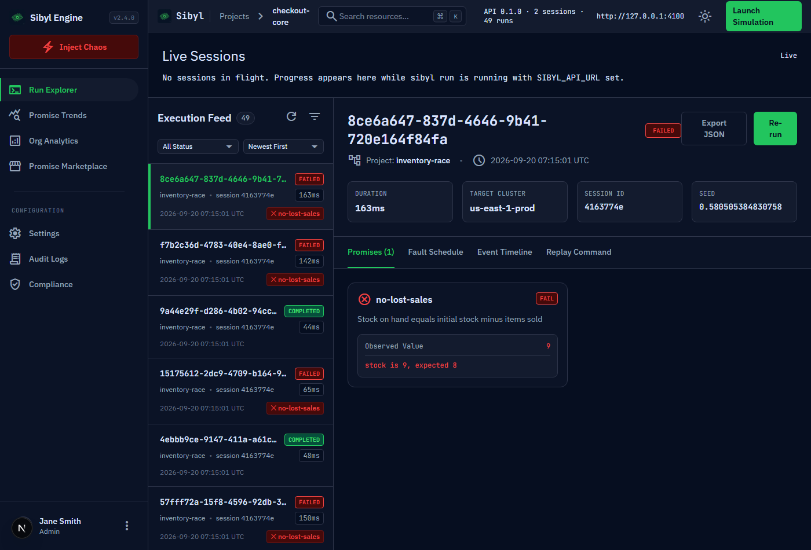
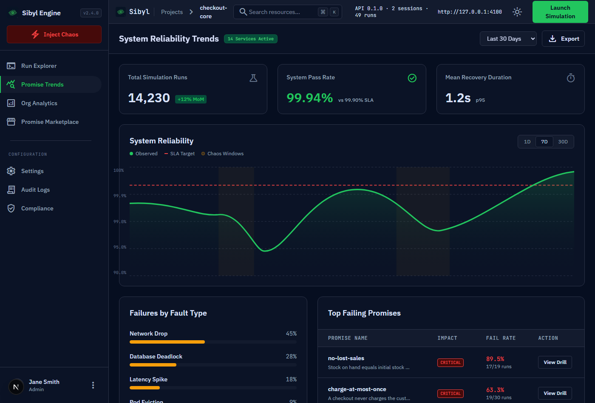

# Sibyl

**Deterministic fault-injection search for Node.js services**
*Find the failure once. Replay it forever.*

Most bugs that reach production are not in the happy path. They are in what your code does when a
payment call returns 503 and it retries without an idempotency key; when the write to the stock
service is slow enough that two purchases read the same number; when the second of three queries in
a transaction fails. You cannot unit-test these, because they depend on *which* call fails, *how*,
and *when* — and you cannot reproduce them from a production log, because the timing is gone.

Sibyl runs your code many times. In each run, drivers intercept its I/O — `fetch`, `http.request`, your
`pg` pool, your Kafka client — and a search algorithm decides which calls fail and how. After every run,
the invariants you wrote in code (*a checkout never charges twice*, *stock equals initial minus sold*)
are checked. A run that breaks one is saved with the seed that produced it, and `sibyl replay` runs it
again, with the same faults in the same places, as many times as you need to fix it.

Sibyl is a test tool. It runs next to the code under test, on your machine or in CI; nothing is
injected into production.

---

## What it looks like

Unedited output from the two examples in this repository.

**A checkout that retries a failed payment without an idempotency key** —
[`packages/cli/examples/quickstart`](packages/cli/examples/quickstart/sibyl.config.ts), the config
`sibyl init` generates:

```
$ sibyl run -n 30 --seed readme

Result  30 runs · 18 failed · 0.3s
Seed readme · strategy ucb1 · saved .sibyl/sessions/92234399-351a-4dca-a607-5c9280efadb7.json

Runs that did not pass (showing 5 of 18)
  FAILED 1c72f7b2  HTTP/HTTP_5XX @p=0.625
    ✗ charge-at-most-once — charged 2 times
  FAILED e35b7bc1  HTTP/HTTP_5XX @p=0.875
    ✗ charge-at-most-once — charged 2 times
  ...

Reproduce: sibyl replay 1c72f7b2

$ sibyl replay 1c72f7b2 --events

Replaying 1c72f7b2-8017-4cc3-8186-36a339550ade
Seed 0.9339506777469069 · HTTP/HTTP_5XX @p=0.625 · originally FAILED

Status    FAILED
  ✗ charge-at-most-once — charged 2 times
  2026-09-14T18:36:50.314Z HTTP {"method":"POST","url":"http://127.0.0.1:52479/pay","statusCode":500,"durationMs":0}

✔ Reproduced: same outcome and same fault decisions.
```

**A lost update under a slow write** —
[`packages/cli/examples/inventory-race`](packages/cli/examples/inventory-race/sibyl.config.ts). The
fault is a `SLOW_RESPONSE` of 1–120 ms on `PUT`, and most delays are harmless: the Bayesian strategy has
to find the ones longer than the 25 ms gap between the two purchases. Delays of 2 and 12 ms passed;
everything from 27 ms up lost a sale. One run at 7 ms failed once and then passed on retry with the same
seed — a real timing flake, reported as `INTERMITTENT` instead of being counted as a pass or a failure:

```
  INTERMITTENT f6592a20  HTTP/SLOW_RESPONSE 7ms @p=1
    ✗ no-lost-sales — stock is 9, expected 8
  FAILED 2aef531a  HTTP/SLOW_RESPONSE 117ms @p=1
    ✗ no-lost-sales — stock is 9, expected 8
  FAILED 28850707  HTTP/SLOW_RESPONSE 35ms @p=1
    ✗ no-lost-sales — stock is 9, expected 8
```

The dashboard reads the same sessions from the API. `pnpm screenshots` regenerates these images by seeding
a real API with both examples through the real CLI and driving the dashboard in headless Chromium, so
they cannot drift from what it renders:

| | |
|---|---|
|  |  |
| **Run explorer.** Every run from the API with its status and the promise it broke; the selected run's seed, replay command and the promise's own message. The header shows the API it is connected to. | **Run detail.** The concrete fault schedule the strategy chose, the captured event timeline with the injected fault named on each event, and the command to explain it. |
|  | |
| **Promise trends.** Each promise's fail rate per session. Pages without a backend are tagged *Preview* in the sidebar. | |

---

## Run it

> **Evaluating this?** [`TESTING.md`](TESTING.md) is written for you: what to run first, in what order,
> and the limits stated up front.

Needs **Node 22+** and **pnpm 9**. Nothing else — no database, no Redis, no Docker, no API key.

```bash
git clone https://github.com/devprashant19/Sibyl.git
cd Sibyl
pnpm install
pnpm sibyl run -c packages/cli/examples/quickstart/sibyl.config.ts -n 30
```

To try it on your own code, create a config next to it and edit the workflow:

```bash
mkdir packages/cli/examples/mine && cd packages/cli/examples/mine
node ../../bin/sibyl.js init              # writes sibyl.config.ts here
node ../../bin/sibyl.js run
```

The CLI is not published to npm yet; run it through `pnpm sibyl` from the repository, or
`node packages/cli/bin/sibyl.js`. A config must be able to import `@sibyl/core`, which today means
living inside this workspace.

### With the API and dashboard

```bash
pnpm api                                  # http://127.0.0.1:4000, sessions in ~/.sibyl/data
pnpm dashboard                            # http://localhost:3000
SIBYL_API_URL=http://127.0.0.1:4000 pnpm sibyl run -c packages/cli/examples/quickstart/sibyl.config.ts
```

Open **http://localhost:3000/runs**.

| Command | What it does |
|---|---|
| `pnpm sibyl run` | Search, save the session to `.sibyl/sessions/`, upload if `SIBYL_API_URL` is set |
| `pnpm sibyl ci --junit reports/sibyl.xml` | The same without interactive output; exits 1 if any run did not pass |
| `pnpm sibyl replay <runId>` | Re-execute one run and check it reproduces (id prefix is enough) |
| `pnpm sibyl explain <runId>` | Root-cause explanation from Claude, grounded in the run's events (needs `ANTHROPIC_API_KEY`) |
| `pnpm sibyl doctor` | Config loads? API reachable? Token right? |

Full reference: [`docs/cli.md`](docs/cli.md).

---

## Prove it rather than read about it

Every claim in this README and in [`ARCHITECTURE.md`](ARCHITECTURE.md) is executable:

```bash
pnpm smoke          # 22 end-to-end checks: starts the real API, runs the real CLI with real
                    # fault injection, uploads, reads it back over REST and SSE, checks the same
                    # seed reproduces in a fresh process, replays a run locally and from the API
pnpm test           # unit suites for every package (turbo)
pnpm test:drivers   # the fault drivers, including determinism properties
pnpm typecheck      # tsc --build over every TypeScript package: 0 errors
```

`pnpm smoke` is the one to run first. It needs nothing running, takes about fifteen seconds, cleans up
after itself, and exits non-zero on the first thing that is wrong:

```
API
  ✓ health ok at http://127.0.0.1:50858
  ✓ writes require a token when SIBYL_API_TOKEN is set
  ✓ an upload without the token is refused (401)
  ✓ malformed JSON is a 400, not a 500
CLI
  ✓ sibyl init writes a config
  ✓ sibyl doctor passes config and API checks
  ✓ sibyl ci exits 1 when a promise fails
  ✓ the search ran 40 runs and found failures (24 failed)
  ...
Replay
  ✓ a failing run replays to the same outcome and fault decisions (by id prefix)
  ✓ the same run replays from the API when it is not stored locally
  ✓ replaying an unknown run fails with a clear message

22 checks passed
```

---

## How a run works

Write a config: the workflow, the faults it may meet, and what must stay true.

```ts
import { defineConfig } from '@sibyl/core';

export default defineConfig({
  drivers: ['http'],
  workflow: async () => { await checkout(); },
  templates: [
    { id: '…uuid…', spec: { domain: 'HTTP', type: 'HTTP_5XX' }, probabilityRange: [0, 1] },
  ],
  promises: [
    {
      id: 'charge-at-most-once',
      description: 'A checkout never charges the customer twice',
      severity: 'CRITICAL',
      evaluate: () => ({ passed: charges <= 1, message: `charged ${charges} times` }),
    },
  ],
});
```

For each run, the strategy turns templates into concrete schedules ("HTTP_5XX with probability
0.625"). The engine derives a seed for the run and forks one random stream per fault domain from it.
When your code calls `fetch`, the driver asks the engine; the engine rolls that domain's stream against
each matching schedule and answers with a fault or nothing. Afterwards every promise is evaluated; a
failing run is retried on the same seed to separate real failures from flakes; the strategy learns
from the result and picks the next schedule.

Because every decision comes from the seed, `sibyl replay` gets the same decisions. The one thing a seed
cannot control is wall-clock timing, and replay tells you when an outcome depended on it.

**Search strategies** — `--strategy ucb1` (default; also shrinks a failing schedule towards the fewest
faults that still fail), `mcts`, or `bayesian` (learns which delay values fail).
**Fault domains** — HTTP, database (`pg`, `mysql2`), message queues (Kafka, SQS), gRPC, filesystem,
child processes, clock skew and time jumps, CPU and memory pressure.
Details: [`ARCHITECTURE.md`](ARCHITECTURE.md) §3.

---

## What is here, and what state it is in

This is a pnpm + Turborepo monorepo. The main path — config, engine, drivers, CLI, API, dashboard — works
end to end and is tested end to end. Some packages are earlier than that, and are labelled here rather
than left for you to discover.

| Package | What it is | State |
|---|---|---|
| [`packages/core`](packages/core) | Engine: PRNG, virtual clock, orchestrator, strategies, promises. `@sibyl/core/enterprise` and `@sibyl/core/queue` hold server-side modules | **Working** |
| [`packages/fault-drivers`](packages/fault-drivers) | HTTP, db, mq, grpc, filesystem, process, resource drivers | **Working** (db, mq integration tests need Docker) |
| [`packages/cli`](packages/cli) | `sibyl` — run, ci, replay, sessions, explain, investigate, retro, doctor, init | **Working** |
| [`packages/api`](packages/api) | REST + SSE API, file-backed session store | **Working** |
| [`packages/dashboard`](packages/dashboard) | Runs, run detail, trends, live sessions | **Working**; analytics, marketplace and settings pages are marked *Preview* in the UI |
| [`packages/agent`](packages/agent) | Explainer, Investigator, Patcher, Postmortem on Claude, with budget and cache guardrails | **Working** (tested without network) |
| [`packages/shared`](packages/shared) | Zod schemas: fault specs, events, and the CLI ↔ API ↔ dashboard contract | **Working** |
| [`packages/ui`](packages/ui) | Shared React components | **Working** |
| [`packages/sdk-node`](packages/sdk-node) | Typed `definePromise` / `defineConfig` helpers | Working, thin |
| [`packages/worker`](packages/worker) | BullMQ worker for sandboxed distributed runs | **Scaffold** — lock and DLQ tested; nothing enqueues jobs and the sandbox entrypoint does not exist |
| `packages/sdk-python`, `sdk-go`, `sdk-java` | Promise helpers for other languages | **Scaffold** — not connected to the engine |
| `packages/vscode-extension`, `packages/integrations` | Editor command and CI wrappers around the CLI | **Scaffold** |
| [`infra`](infra) | Terraform / Pulumi for a worker pool | **Scaffold**, unverified |

The worker, billing, SSO/SCIM, audit and compliance modules describe a hosted, multi-tenant Sibyl. They
are libraries with tests, not features of the running system; [`ARCHITECTURE.md`](ARCHITECTURE.md) §6.3
lists exactly what is and is not wired.

---

## Configuration

Nothing is required to run locally. Every variable Sibyl reads:

| Variable | Read by | Default | Purpose |
|---|---|---|---|
| `SIBYL_API_URL` | CLI | — | Upload sessions and progress here; `replay` also looks runs up here |
| `SIBYL_API_TOKEN` | CLI, API | — | Bearer token; when set on the API, every write must carry it |
| `PORT` | API | `4000` | |
| `SIBYL_API_HOST` | API | `127.0.0.1` | Bind address; the API warns if non-loopback without a token |
| `SIBYL_DATA_DIR` | API | `~/.sibyl/data/sessions` | Session files; `:memory:` for none |
| `SIBYL_RETENTION_DAYS` | API | — | Delete sessions older than this, hourly |
| `SIBYL_CORS_ORIGIN` | API | `*` | |
| `SIBYL_WEBHOOK_URL`, `SIBYL_WEBHOOK_SECRET` | API | — | Signed webhook on every stored session |
| `NEXT_PUBLIC_SIBYL_API_URL` | Dashboard | `http://localhost:4000` | Where the browser reaches the API |
| `ANTHROPIC_API_KEY` | CLI | — | `explain`, `investigate`, `retro` |
| `SIBYL_AGENT_MODEL` | Agents | `claude-sonnet-5` | |
| `SIBYL_DISABLE_AI` | Agents | — | `1`/`true`/`yes`/`on` disables every AI call |
| `SIBYL_AGENT_CACHE_DIR`, `SIBYL_AGENT_BUDGET_FILE` | Agents | `~/.sibyl/…` | |
| `REDIS_URL` | Worker | `redis://localhost:6379` | Scaffold only |

Details and the config file format: [`docs/configuration.md`](docs/configuration.md).

---

## Documentation

| Document | For |
|---|---|
| [`TESTING.md`](TESTING.md) | Evaluating Sibyl: what to run, what to look at, known limits |
| [`ARCHITECTURE.md`](ARCHITECTURE.md) | How it works: components, sequence diagrams, state, security, verification matrix |
| [`docs/`](docs/README.md) | Reference: [CLI](docs/cli.md), [REST API](docs/api.md), [configuration](docs/configuration.md), [development](docs/development.md) |
| [`CLAUDE.md`](CLAUDE.md) | Working on the code: the invariants that are easy to break by accident |
| [`CONTRIBUTING.md`](CONTRIBUTING.md), [`SECURITY.md`](SECURITY.md), [`SELF_HOSTING.md`](SELF_HOSTING.md) | |

## License

Proprietary. No license file is included; all rights reserved by the author.
