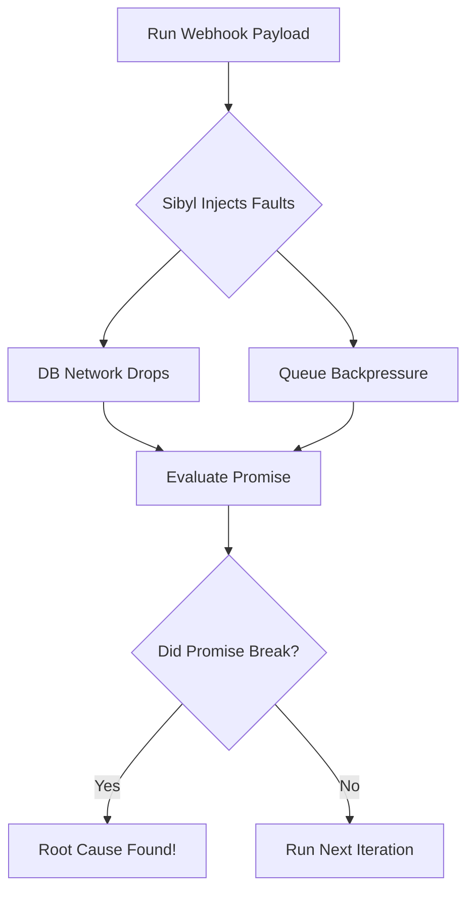

## Traditional Testing is Broken for Distributed Systems

Unit tests check logic. Integration tests check APIs. But neither catches what actually takes down your production environment: **Partial Failures**.

When a network request times out, a database transaction is dropped, or two threads execute simultaneously, your system enters an edge case. Randomly testing these (like Chaos Monkey) is inefficient. You need **Coverage-Guided Chaos Engineering**.

## What is a Promise?

In Sibyl, you don't write tests that say "make sure this API returns 200." You write **Promises** (Invariants) that describe the fundamental laws of your business logic.

A Promise is a simple function that returns a pass/fail result based on the state of your system.

**Examples of Promises:**
- "A user's balance can never be negative."
- "An order is never processed twice."
- "There are never orphaned records in the database."

## Deterministic Simulation Testing (DST)

Sibyl uses **Deterministic Simulation**. When a run is executed, it is assigned a seed (e.g., `42`).

If Sibyl finds a bug, it will hand you a `FaultSchedule` and a seed. Because the execution is deterministic at the application boundary, re-running that exact sequence will produce the *exact same bug every single time*, completely eliminating "flaky" or "unreproducible" chaos tests.
